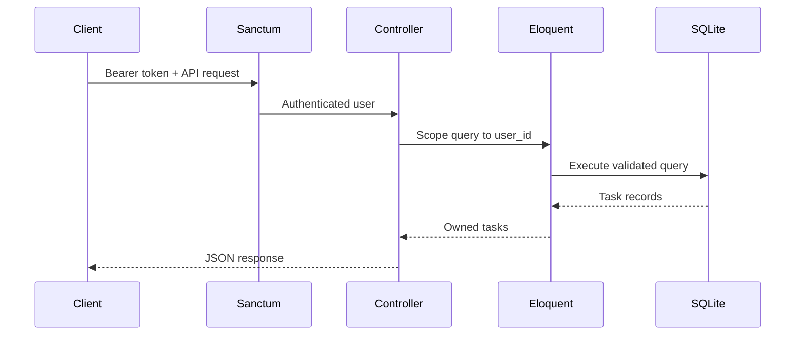
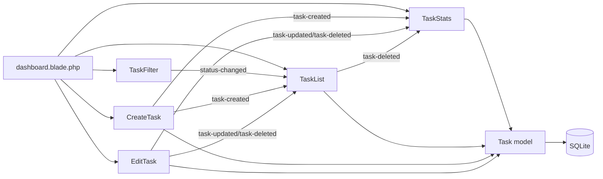

# Enterprise Task Management API

A Laravel 13 task management system demonstrating authenticated REST APIs, ownership authorization, SQLite migrations, and a reactive Livewire 4 dashboard.

## Stack

- PHP 8.5 and Laravel 13
- Livewire 4 and Tailwind CSS 4
- Laravel Sanctum for API authentication
- SQLite for local development
- PHPUnit for automated tests

## Features

- Browser authentication with Laravel Breeze
- User-owned task CRUD through `/api/tasks`
- Task status workflow: `pending`, `in_progress`, `completed`
- Paginated API and Livewire task lists
- Livewire task creation, editing, filtering, deletion, and statistics
- Ownership checks on every task read and write
- Enterprise admin RBAC with `super_admin`, `admin`, `moderator`, and `user` roles
- Separate admin login at `/admin/login`
- Admin dashboard for user and task moderation
- Audit logging for administrative actions and security review

## Setup

```powershell
composer install
Copy-Item .env.example .env
New-Item -ItemType File -Force database/database.sqlite
php artisan key:generate
php artisan migrate
php artisan db:seed
npm install
npm run build
php artisan serve
```

Open `http://127.0.0.1:8000/`. The root URL redirects to the authenticated dashboard. Register a user or use a seeded account. Seeded users use the default factory password from `UserFactory`.

## Admin system

This application includes a parallel enterprise admin layer. Regular users use the standard dashboard, while administrators use the dedicated admin area with:

- `/admin/login` for admin authentication
- `/admin/dashboard` for system overview
- `/admin/users` for user management
- `/admin/tasks` for moderation
- `/admin/audit-logs` for audit trail review
- `/admin/settings` for super-admin settings

### RBAC hierarchy

The admin subsystem uses four explicit roles:

- `super_admin`: full system access, can manage all users, tasks, settings, and audit logs
- `admin`: operational admin access for user and task management
- `moderator`: task oversight and moderation without user-management privileges
- `user`: standard user role for personal task management only

### Seeded admin accounts

The seeded admin test accounts are:

| Role | Email | Password |
|---|---|---|
| `super_admin` | `admin@example.com` | `password` |
| `admin` | `admin2@example.com` | `password` |
| `moderator` | `moderator@example.com` | `password` |

These credentials are intended for local development and QA validation of the RBAC and audit boundaries.

### Audit logging and schema

Administrative actions are recorded in the `audit_logs` table with:

- `admin_id`
- `action`
- `model_type`
- `model_id`
- `changes` as a JSON payload with before/after values
- `ip_address`
- `user_agent`
- `created_at`

This supports audit review, forensic investigation, and CSV export for super-admins.

### Admin routes and API endpoints

#### Web routes

- `GET /admin/login` — admin sign-in page
- `POST /admin/login` — authenticate an admin user
- `GET /admin/dashboard` — admin overview
- `GET /admin/users` — user management
- `GET /admin/tasks` — task moderation
- `GET /admin/audit-logs` — audit trail review
- `GET /admin/settings` — system settings

#### API routes

- `POST /api/admin/login` — admin login endpoint
- `GET /api/admin/users` — user listing
- `PUT /api/admin/users/{user}` — user updates
- `POST /api/admin/users/{user}/suspend` — suspend a user with reason
- `POST /api/admin/users/{user}/unsuspend` — unsuspend a user
- `POST /api/admin/users/{user}/roles/{role}` — assign a role
- `GET /api/admin/tasks` — task list for moderation
- `PUT /api/admin/tasks/{task}` — reassign or moderate a task
- `POST /api/admin/tasks/bulk-action` — bulk task actions
- `GET /api/admin/audit-logs` — view audit records
- `GET /api/admin/audit-logs/export` — CSV export
- `GET /api/admin/analytics/*` — admin analytics endpoints

The admin system is documented in [ADMIN-SETUP.md](ADMIN-SETUP.md).

## API

All task endpoints require a Sanctum token using `Authorization: Bearer <token>`.

| Method | Endpoint | Purpose |
|---|---|---|
| GET | `/api/user` | Return the authenticated user |
| GET | `/api/tasks` | List the authenticated user's tasks |
| POST | `/api/tasks` | Create a task |
| GET | `/api/tasks/{task}` | Show an owned task |
| PUT/PATCH | `/api/tasks/{task}` | Update an owned task |
| DELETE | `/api/tasks/{task}` | Delete an owned task |

Create-task payload:

```json
{
  "title": "Review release plan",
  "description": "Confirm acceptance criteria with stakeholders.",
  "status": "pending"
}
```

## Architecture





## Authentication

Breeze provides session authentication for the dashboard at `/login`, `/register`, and `/logout`. Sanctum protects API routes independently. Create personal access tokens in an authenticated application flow and send them as Bearer tokens to the API.

## Testing

Tests are written for PHPUnit and are intentionally not run as part of setup instructions here.

```powershell
php artisan test --filter=AdminSystemTest
```

Run the admin RBAC suite separately to validate role boundaries, guardrails, moderation flows, and audit-log assertions.

## Structure

- `app/Http/Controllers`: REST API controllers
- `app/Http/Requests`: request validation and authorization
- `app/Livewire`: dashboard components
- `app/Models`: Eloquent models, scopes, and ownership logic
- `database/migrations`: schema history and indexes
- `database/seeders`: reproducible sample data
- `resources/views`: dashboard, auth, layout, and component views
- `routes/api.php`: Sanctum-protected API routes
- `routes/web.php`: browser routes

## Useful Commands

```powershell
php artisan optimize:clear
php artisan migrate:fresh --seed
php artisan route:list
npm run build
php artisan serve
```

`php artisan clear-all` is not a Laravel command; use `php artisan optimize:clear` instead.

## Conventional Commits

```text
feat: add authenticated task resource controller
feat: add livewire task dashboard
fix: enforce task ownership on updates
test: cover sanctum task authorization
 docs: document task API architecture
```
